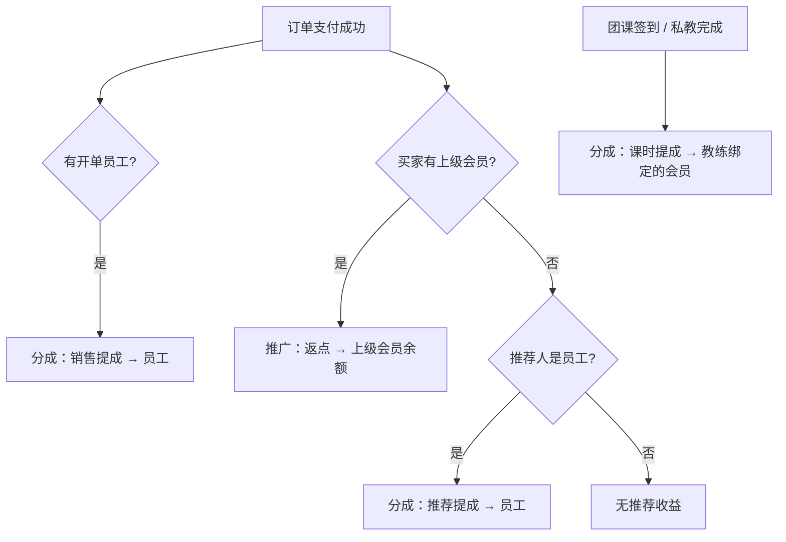

# 提成 / 推广操作手册

适用系统：回龙观公园综合场地管理（观野 FIT / 综合经营）  
版本口径：教练主身份 = 会员（方案 A）；提成与推广为两套并行体系。

---

## 1. 先分清两套钱

| | 分成管理（提成） | 推广管理（返点） |
|---|---|---|
| 管什么 | 员工开单提成、教练课时提成、员工推荐提成 | 会员裂变：下级消费返点、下级折扣 |
| 钱记在哪 | 提成记录 `CommissionRecord` | 会员返点流水 `MemberRebateLedger` |
| 谁拿钱 | 开单员工 / 教练绑定的会员 / 员工推荐人 | 上级会员（推广人） |
| 怎么结算 | 提成结算页，或教练「我的佣金」提现 | 会员「我的推广」提现 → 提现审核 |
| 配置入口 | 观野 FIT → 分成管理 | 综合经营 → 推广管理 |

**一句话**：前台开单、上课核销产生的「工资式提成」走分成；会员带会员产生的「返点」走推广。不要混在一个账户里看。



---

## 2. 菜单入口一览

### 2.1 分成管理（观野 FIT）

| 菜单 | 路径 | 用途 |
|---|---|---|
| 提成规则 | `/commission-rules` | 按商户配置计提规则 |
| 提成结算 | `/commission-records` | 查明细、确认、结算、作废 |
| 我的佣金 | `/my-commission` | 教练自助看课时提成并申请提现 |
| 教练档案 | `/coaches` | 新建教练必须关联会员；可选绑后台账号 |

### 2.2 推广管理（综合经营）

| 菜单 | 路径 | 用途 |
|---|---|---|
| 推广配置 | `/platform/promotion-config` | 场地级默认返点、折扣、提现门槛 |
| 推广方案 | `/platform/promotion-settings` | 会员一人一码；可覆盖个人比例 |
| 会员返点 | `/rebates` | 查返点流水、人工调账 |
| 提现审核 | `/payouts` | 审核教练佣金提现 + 会员返点提现 |

### 2.3 会员端

| 端 | 入口 |
|---|---|
| 会员 H5 | 「我的」→ 我的推广 |
| 小程序 | 「我的」→ 推广 |

---

## 3. 上线前必做配置

### 3.1 推广配置（场地级）

路径：综合经营 → 推广管理 → **推广配置**

| 项 | 说明 | 建议 |
|---|---|---|
| 自动创建会员推广码 | 建档或打开「我的推广」时是否发卡 | 开启，方便裂变 |
| 默认返点比例 | 下级实付 × 比例；填小数，如 `0.05` = 5% | 按商务约定 |
| 默认下级折扣 | 下级下单折扣；上限 0.9（九折） | 按商务约定 |
| 最低提现金额 | 会员申请提现门槛 | 如 `1.00` |
| 提现冷却天数 | 入账后满 N 天才可提 | 防刷；可为 `0` |

注意：比例一律填 **0～1 的小数**，不要填 `5` 当 5%。

### 3.2 提成规则（商户级）

路径：观野 FIT → 分成管理 → **提成规则**

按需为每个健身房商户配置，常用场景：

| 场景 | 受益方（页面自动决定） | 实际入账 |
|---|---|---|
| 会籍销售 | 销售员工 | 开单员工 |
| 私教课包销售 | 销售员工 | 开单员工 |
| 零售销售 | 销售员工 | 开单员工 |
| 活动报名 | 销售员工 | 开单员工 |
| 团课课时 | 教练 | **教练绑定的会员** |
| 私教课时 | 教练 | **教练绑定的会员** |
| 推荐成交 | 推荐人 | 仅「员工推荐」路径写提成记录 |

计算方式（basis）限制：

- 销售 / 推荐：按金额比例、按笔固定  
- 团课课时：按出席人头、按笔固定  
- 私教课时：按金额比例、按笔固定、按课时  

同场景多条规则时，按 **优先级升序** 取第一条生效规则。可设门槛、封顶、生效区间、是否启用。推荐场景可勾「仅首单」。

### 3.3 教练档案（必须先绑会员）

路径：观野 FIT → 教练管理 → **教练档案** → 新建

| 字段 | 是否必填 | 说明 |
|---|---|---|
| 商户 | 必填 | 所属健身房 |
| 关联会员 | **必填** | 已有会员主档；推广码、课时提成都挂这人 |
| 显示名 | 必填 | 前台展示名 |
| 后台员工账号 | 可选 | 仅用于登录「我的佣金」 |
| 私教课时个人比例 | 可选 | 有则优先于商户 `pt_session` 规则 |

规则：

1. 同一会员不能绑两个教练。  
2. 绑定后系统会确保该会员有推广码，列表里显示为教练「推广码」。  
3. **未关联会员时，团课签到 / 私教完成会计提失败**（报错：教练未关联会员）。  
4. 只想让教练自己看佣金：必须同时绑「关联会员」+「后台员工账号」，并给该员工 `commission:self`（或更高）权限。

---

## 4. 日常操作：分成（提成）

### 4.1 钱什么时候自动产生

| 业务动作 | 产生什么 | 类别 |
|---|---|---|
| 前台开单并支付成功，且订单有开单员工 | 销售提成 → 员工 | 销售提成 |
| 团课场次签到出席 | 课时提成 → 教练绑定会员 | 课时提成 |
| 私教预约标记「已完成」 | 课时提成 → 教练绑定会员 | 课时提成 |
| 新会员由员工推荐且无会员上级，成交后 | 推荐提成 → 员工 | 推荐提成 |
| 新会员有上级会员，成交后 | **不走提成表**，走推广返点 | — |

说明：

- 线上会员自助下单通常 **没有开单员工**，不会产生销售提成。  
- 同一笔业务幂等：同一场景 + 来源单据 + 受益人只保留一条；状态为「待确认」时可因业务重算刷新金额。

### 4.2 提成结算页怎么用

路径：分成管理 → **提成结算**

1. 按商户 / 类别 / 场景 / 状态 / 受益人 / 日期筛选。  
2. 核对明细：受益人、类别、来源单据（如场次 #、订单 #）、教练追溯 ID、金额。  
3. 状态流转：

```
待确认 → 已确认 → 已结算
           ↘ 可作废
任意非终态也可作废；已结算 / 已作废不可再改
```

4. 批量：勾选后「批量确认」「批量结算」。运营直接点「结算」= 线下已打款的记账标记。  
5. **不要与教练提现单重复结算**：若教练已通过「我的佣金」发起提现并审核打款，记录会变为已结算；勿再批量结算同一批。

### 4.3 教练自助提现

路径：分成管理 → **我的佣金**（需员工账号已绑教练档案）

1. 查看绑定会员名下的课时提成汇总与明细（含类别、来源）。  
2. 仅「已确认」且未被提现单占用的记录可申请提现。  
3. 提交后进入「提现审核」；运营通过并登记打款后，对应提成变为「已结算」。  
4. 驳回后记录解锁，可再次申请。

注意：纯开单员工（非教练）**没有**「我的佣金」入口，其销售提成只能由运营在「提成结算」处理。

### 4.4 退款对提成的影响

| 退款情况 | 提成处理 |
|---|---|
| 全额退 | 相关提成作废；若已结算，需人工线下追回 |
| 部分退 | 下调仍为待确认 / 已确认的金额 |

---

## 5. 日常操作：推广（返点）

### 5.1 推广关系怎么建立

只认 **一级**：A 推荐 B，B 消费返给 A；B 再推荐 C，返给 B，不返给 A。

常见方式：

1. 会员在「我的推广」分享推广码 / 链接 / 二维码，新人扫码注册。  
2. 后台会员档案填写推广会员 / 推荐人。  
3. 教练的推广码 = 其关联会员的推广码，学员扫教练码即成为该会员的下级。

### 5.2 返点与折扣怎么算

1. 下级下单有上级时：  
   - **折扣**：应付金额按上级（或场地默认）折扣计算，写入订单折扣字段。  
   - **返点**：按实付 × 返点比例记入上级会员返点账户。  
2. 个人推广方案可覆盖场地默认比例；未覆盖则用场地默认。  
3. 返点余额 **不能** 抵扣消费，只能提现。  
4. 若返点比例为 0，系统可能用商户「推荐成交」规则金额作为 fallback 记入返点账（以线上配置为准）。

### 5.3 推广方案（会员级）

路径：推广管理 → **推广方案**

- 一人一码；可查看 / 停用。  
- 可为单个推广人覆盖返点、下级折扣。  
- 从会员列表也可跳转管理。

### 5.4 会员如何提现

1. 会员端打开「我的推广」，查看可提现余额（已扣冷却期）。  
2. 填写金额发起提现 → 余额冻结。  
3. 运营在 **提现审核** 通过并登记线下打款。  
4. 驳回则解冻退回。

运营也可在 **会员返点** 页查看流水，必要时人工调账。

### 5.5 退款对返点的影响

下级订单退款会生成冲回流水。若余额不足冲回，会记欠额，后续新入账优先抵债。

---

## 6. 提现审核（共用入口）

路径：综合经营 → 推广管理 → **提现审核**

两类申请都会出现在这里：

| 来源 | 申请人 | 审核通过后 |
|---|---|---|
| 教练佣金提现 | 绑定了教练档案的员工 | 对应提成记录 → 已结算 |
| 会员返点提现 | 会员 | 返点冻结 → 已打款 |

操作顺序建议：核对金额与账户 → 通过 → 线下打款 → 登记「已打款」。驳回需填写原因。

---

## 7. 推荐场景怎么选体系

| 实际情况 | 走哪套 |
|---|---|
| 会员 A 带会员 B 成交 | 推广返点 → A |
| 员工在后台把新人挂成自己推荐，且新人没有会员上级 | 分成「推荐提成」→ 该员工 |
| 新人既有会员上级，又有员工推荐痕迹 | **优先会员上级返点**，不写员工推荐提成 |
| 教练用自己的推广码拉新 | 等价于「教练关联会员」在拉新 → 推广返点 |

产品侧已弱化「员工推荐」录入；主推会员裂变与教练绑会员推广码。

---

## 8. 角色权限建议

| 角色 | 建议权限 | 能做什么 |
|---|---|---|
| 超管 / 运营 | 分成读写、推广读写、提现审核 | 配规则、结算、审提现 |
| 健身房教练 | `commission:self` | 仅「我的佣金」 |
| 前台收银 | 开单权限即可 | 开单带 `seller` 后自动计提销售提成 |
| 会员 | 会员端登录 | 「我的推广」 |

---

## 9. 推荐操作 SOP

### 9.1 新商户开通分成 + 推广

1. 场地：配好 **推广配置**（返点、折扣、提现门槛）。  
2. 商户：配好 **提成规则**（至少：会籍/课包销售、团课、私教课时）。  
3. 为每位教练：先建或选定会员 → **教练档案关联该会员** → 需要自助看佣金再绑员工账号。  
4. 用一笔测试开单、一笔团课签到、一笔私教完成，在「提成结算」核对记录。  
5. 用测试推广码注册下级并消费，在「会员返点」核对入账。

### 9.2 每月结算节奏（示例）

1. 月底前：在「提成结算」筛本月待确认 → 核对 → 批量确认。  
2. 销售员工：运营批量结算或导出后线下发薪。  
3. 教练：通知其在「我的佣金」申请提现，或运营直接批量结算。  
4. 会员返点：在「提现审核」处理待审单，登记打款。  
5. 全额退款订单：检查对应提成是否已作废、返点是否已冲回。

---

## 10. 常见问题

**Q：开了单为什么没有销售提成？**  
A：订单没有开单员工（如会员自助线上支付），或该商户未配置对应销售场景规则 / 规则未启用 / 未达门槛。

**Q：团课签到报错「教练未关联会员」？**  
A：到教练档案补「关联会员」后再签到或重算。

**Q：教练登录看不到「我的佣金」或提示未绑定教练档案？**  
A：员工账号未写入教练档案的「后台员工账号」字段，或角色缺少佣金自助权限。

**Q：教练有推广码，学员消费钱进谁账户？**  
A：进教练关联的那个 **会员** 的返点账户，不是员工工资账户。课时提成也是进同一会员（提成记录受益人 = 会员）。

**Q：提成结算和提现审核都点了，会不会发两遍？**  
A：同一条提成变成「已结算」后不能再结算。规范做法二选一：运营批量结算，或走教练提现单。

**Q：返点能不能直接抵房费 / 课包？**  
A：不能，只能提现。

**Q：下级的下级消费，上级能拿到吗？**  
A：不能，只返一级。

**Q：比例填 5 行不行？**  
A：不行。应填 `0.05` 表示 5%。

**Q：已结算后又全额退款怎么办？**  
A：系统会把提成标作废，但钱已打出需人工追回；返点侧会冲回，不足则记欠。

---

## 11. 字段速查

### 提成类别

| 类别 | 含义 |
|---|---|
| 销售提成 | 会籍 / 课包 / 零售 / 活动开单 |
| 课时提成 | 团课出席、私教完成 |
| 推荐提成 | 员工推荐成交（无会员上级时） |

### 提成状态

| 状态 | 含义 |
|---|---|
| 待确认 | 刚计提，可因业务重算刷新 |
| 已确认 | 可结算或可被教练申请提现 |
| 已结算 | 已标记打款完成 |
| 已作废 | 退款或人工作废 |

### 返点流水类型（常见）

| 类型 | 含义 |
|---|---|
| 下级消费入账 | 正常赚取 |
| 退款冲回 | 下级退款扣回 |
| 提现冻结 / 打款 / 退回 | 提现生命周期 |
| 调账 | 运营人工调整 |

---

## 12. 测试检查清单

- [ ] 推广配置已保存，比例为小数  
- [ ] 商户提成规则覆盖销售与课时场景  
- [ ] 每位在职教练已关联会员，列表有推广码  
- [ ] 需自助看佣金的教练已绑员工账号  
- [ ] 测试开单（带销售员）→ 提成结算出现「销售提成」  
- [ ] 测试团课签到 → 出现「课时提成」，受益人为会员  
- [ ] 测试私教完成 → 同上  
- [ ] 测试推广码拉新消费 → 会员返点有入账  
- [ ] 教练申请提现 → 提现审核通过 → 记录变已结算  
- [ ] 会员申请提现 → 审核打款成功  

---

文档维护：业务规则以线上配置与当前后端实现为准；若规则变更，请同步修订本手册第 1、3、4、5 节。
